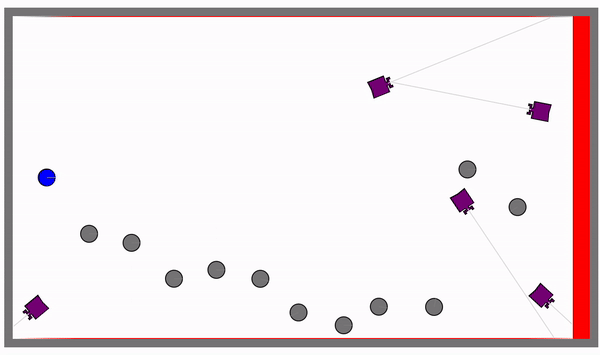

- [EEP-520 Project - Crossing Game](#eep-520-project---crossing-game)
  - [Project Overview](#project-overview)
    - [Function:](#function)
    - [Code Application](#code-application)
  - [Challenges](#challenges)
      - [1. The hint detection for all the agent.](#1-the-hint-detection-for-all-the-agent)
      - [2. The implementation of free patroller](#2-the-implementation-of-free-patroller)
      - [3. The keyboard control for player robot.](#3-the-keyboard-control-for-player-robot)
  - [Installation](#installation)
      - [Docker Container with Enviro](#docker-container-with-enviro)
      - [Running Code](#running-code)
  - [Function Instruction](#function-instruction)
  - [Sources](#sources)
  - [License](#license)


# EEP-520 Project - Crossing Game
**Name: Qingchuan Hou**

**UW ID: 2127437**

## Project Overview
This project is a simple little game. Players need to control the robot, pass through the dense patrol area, and reach the end point without being detected.

### Function:
The following picture is a demo example of this game. Players need to control the blue ball to pass through the patrol area to the red area. There are two different kinds of patrollers, the grey ones are fixed-point patrollers that only move up and down. The blue ones are freedom patrols. The gray patroller will change the movement trajectory of the blue patroller when hitting the blue patroller. This increasing the uncertainty of the blue patroller and increasing the difficulty of the game.

### Code Application
The code part of this project mainly uses C++ and JSON. All functions in the project are implemented based on the [Enviro](https://github.com/klavinslab/enviro) simulator. Enviro is a simple multi-agent simulator based on [Emla](https://github.com/klavinslab/elma) that provides many robot simulation capabilities such as size, movement, and sensors. And functions can be combined with each other. For example, through programming, the robot can be made to perform corresponding actions based on the data obtained by the sensors. This project is realized through Enviro's robot simulation function, which is combined to place robots with different patrol methods. The gray patroller realizes fixed-point patrol by changing direction by detecting the collision of the boundary. The blue patroller is freedom patroller with distance sensors and mobile steering controls. Players control the robot through external device input (keyboard, mouse) to move and avoid patrolling robots. finally reach the target place. 

## Challenges
There are three main challenges in this project:

#### 1. The hint detection for all the agent.
Hint detection is used in many places in the game, including the change of the patrol direction of the fixed-point patroller behind the hint boundary, and the decision of winning or losing when the player robot hint the patroller or the target area.

#### 2. The implementation of free patroller
The free patroller combines the distance sensor and the robot movement function to realize the irregular free movement function of the robot

#### 3. The keyboard control for player robot.
The robot controlled by the player realizes the monitoring of external input (keyboard), and makes corresponding movements after detecting the input.


## Installation
This section explains how to install and run the code.
#### Docker Container with Enviro
This project is build with Enviro V1.6

To start a Docker container with ENVIRO pre-loaded into it, do:

```bash
docker run -p80:80 -p8765:8765 -v $PWD:/source -it klavins/enviro:alpha bash
esm start
```
Because this project is build with Enviro V1.6, change `enviro:alpha` to `enviro:v1.6`

The above commands do the following:

- The `-p80:80 option maps _port_ 80 from the Docker container to ports on your host computer. This should allow you to go to

  > http://localhost
  > with your web browser and see the ENVIRO client. It should say "Error: Failed to fetch. Is the server running?" at this point.

- The `-p8765:8765` option allows the ENVIRO client to communicate with the `enviro` server (not yet running) via a _WebSocket_.

- The command `esm start` uses the <u>e</u>nviro <u>s</u>etup <u>m</u>anager to start a web server from which your browser can access the ENVRIO client.

Go to the Enviro's repo [here](https://github.com/klavinslab/enviro) to get more information.

#### Running Code
This project include a Makefile, so it can easily buid in a new computer by using:

```bash
make clean        # Clean up files that may be left over from the last use
make              # Build the project
enviro            # Start the project
```

After build the project, go to website http://localhost to start playing the game.

Using `Control + 'c'` in terminal to exit the game.

## Function Instruction

In this game, the palyer can use the `w`, `a`, `s`, and `d` on keyboard to control the movement of blue palyer robot. Players need to control the robot, pass through the dense patrol area, and reach the end point without being hint by patroller.

If player want to increase or decrease the difficulty of the game, they can change the `LEVEL` variable in 'patrol.cc' file. It will change the moving speed for patrollers

## Sources
1. EEP 520 Winter 2022 Croues Reference [Github Repo](https://github.com/tbonaciUW/EEP_520_Winter2022)
2. The Enviro Simulator. [Githun Repo](https://github.com/klavinslab/enviro)
3. Elma: an event loop and process manager for embedded and reactive systems. [Github Repo](https://github.com/klavinslab/elma)

## License
This software is open source and uses the MIT license. Details can be found [here](LICENSE).